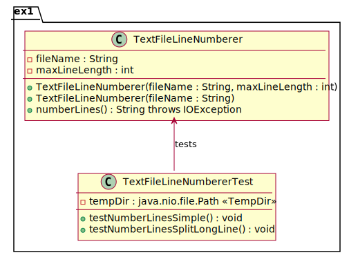
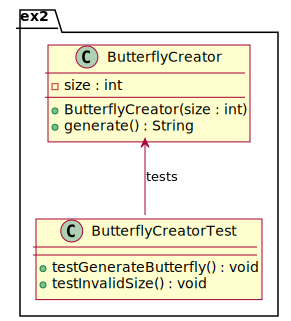
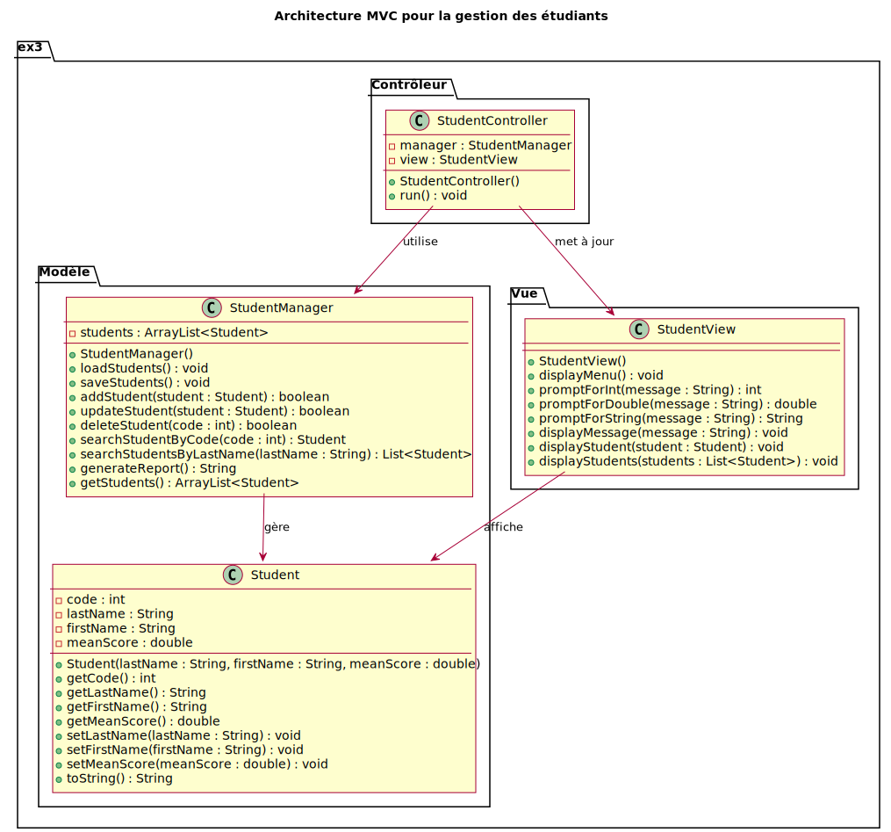
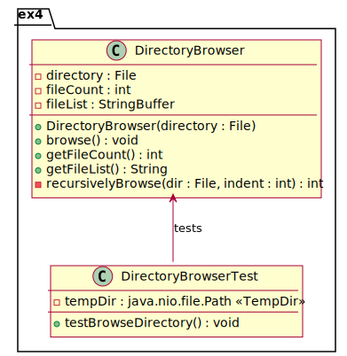

# Consignes pour le TP Java n°4

---

## Installation

1. Ouvrez un terminal à l'endroit où vous souhaitez installer ces fichiers. Clonez ce dépôt à l'aide de la commande suivante :
   ```sh
   git clone https://github.com/alainlebret/java-tp4-students.git
   ```
2. À l'aide d'IntelliJ, choisissez d'ouvrir un projet ("Open") et sélectionnez le dossier qui vient d'être créé en clonant le dépôt ("java-tp4-student").
3. Vérifiez que dans le projet "java-tp4-student" créé, le sous-dossier "src" existe. Celui-ci devrait contenir les paquetages `ex1`, `ex2`, `ex3` et `ex4`.

---

## Tester, tester, tester

Ce TP sera réalisé en mettant en avant les tests. JUnit, notamment sa version 5.x, est la bibliothèque de test standard pour Java. Elle permet d’écrire des tests unitaires simples, lisibles et maintenables. JUnit 5 se compose de plusieurs modules (JUnit Jupiter, JUnit Platform, etc.). Sur le principe, elle devrait vous rappeler "Minunit" rencontrée dans le cours ODL.

Le site officiel de JUnit est le suivant : [https://junit.org/junit5/](https://junit.org/junit5/).

### Annotations de base

- `@Test` : indique qu'une méthode est un cas de test ;
- `@BeforeEach` : préambule exécuté avant chaque test, utile pour initialiser l’état ;
- `@AfterEach` : postambule exécuté après chaque test, pour nettoyer les ressources ;
- `@BeforeAll` et `@AfterAll` : préambule et postambule exécutés une fois avant/après tous les tests (méthodes statiques).

**Exemple**

```java
@BeforeEach
void setUp() {
    // Préambule : initialisation avant chaque test
}

@Test
void testSomething() {
    // Un cas particulier de test
}
```

### Assertions

Les assertions permettent de vérifier les résultats attendus :

- `assertEquals(expected, actual)` : vérifie l'égalité ;
- `assertTrue(condition)` et `assertFalse(condition)` : vérifient une condition ;
- `assertNotNull(object)` : vérifie qu'un objet n'est pas nul ;
- `assertThrows()` : vérifie qu'une exception est levée.

**Exemple**

```java
@Test
void testSum() {
    int sum = calculateSum(2, 3);
    assertEquals(5, sum, "2 + 3 should be equal to 5");
}
```

### Utilisation de `@TempDir`

L'annotation `@TempDir` indique à JUnit qu'il est nécessaire de créer un dossier temporaire pour les tests. Cela permet de tester des opérations sur fichiers sans affecter le système.

**Exemple**

```java
@TempDir
Path tempDir;

@Test
void testFileCreation() throws IOException {
    Path tempFile = tempDir.resolve("test.txt");
    Files.write(tempFile, "Bonjour".getBytes());
    assertTrue(Files.exists(tempFile));
}
```

---

## Exercice n°1

Le diagramme de classes pour l'exercice n°1 est le suivant :



La classe `TextFileLineNumberer` lit un fichier texte et retourne son contenu sous forme de chaîne dans laquelle chaque ligne (ou segment de ligne) est précédée d’un numéro de ligne formaté sur 4 caractères.

- Le constructeur `TextFileLineNumberer(String fileName, int maxLineLength)` initialise un objet avec le nom du fichier à lire ainsi qu'une longueur maximale définissant le nombre de caractères qu'une ligne ne doit pas dépasser (si une ligne est trop longue, elle sera découpée en plusieurs segments).
- Le second constructeur `TextFileLineNumberer(String fileName)` utilise une valeur par défaut de 60 caractères pour la longueur maximale.
- La méthode `numberLines()` ouvre le fichier spécifié et lit son contenu ligne par ligne. Pour chaque ligne lue :
  - Si la ligne est vide, la méthode ajoute simplement le numéro de ligne suivi d'un retour à la ligne ;
  - Sinon, la méthode vérifie si la ligne dépasse la longueur maximale autorisée. Si c'est le cas, elle découpe la ligne en segments de longueur maximale (définie par `maxLineLength`), et chaque segment reçoit un numéro de ligne distinct.
  Chaque ligne est préfixée d'un numéro de ligne formaté (sur 4 chiffres, suivi d'un deux-points et d'un espace). À la fin du processus, la méthode ferme le fichier et retourne une chaîne contenant l’ensemble du contenu numéroté.

La classe de test [`TextFileLineNumbererTest.java`](src/ex1/TextFileLineNumbererTest.java) qui vous est fournie permet de vérifier le cas des lignes ne dépassant la largeur maximale, ainsi que celui de celles qui la dépassent.

--- 

## Exercice n°2
 
Le diagramme de classes pour l'exercice n°2 est le suivant :



La classe `ButterflyCreator` permet de générer un motif en forme de papillon à l'aide d'une chaîne de caractères.

- Le constructeur `ButterflyCreator(int size)` initialise un objet `ButterflyCreator` avec une taille donnée. Le paramètre `size` doit être un entier positif impair. Si la taille est négative, nulle ou paire, le constructeur lève une exception `IllegalArgumentException`.
- La méthode `generate()` génère le motif du papillon et retourne le résultat sous forme de chaîne de caractères. Chaque ligne est assemblée en utilisant un `StringBuilder`, et le motif complet est retourné à la fin de la méthode.

La classe de test [`ButterflyCreatorTest.java`](src/ex2/ButterflyCreatorTest.java) qui vous est fournie permet de vérifier la génération d'un papillon de taille 7, ainsi que la gestion d'une taille incorrecte.

--- 

## Exercice n°3

### Quelques mots sur le patron MVC

MVC pour "modèle-vue-contrôleur" est un patron de conception qui sépare une application en trois composants interconnectés (voir le cours de génie logiciel).

- Le **modèle**  gère les données et la logique métier.
- La **vue** s'occupe de l'affichage et de l'interface utilisateur.
- Le **contrôleur** traite les entrées utilisateur et fait le lien entre modèle et vue.


### Application à l'exercice

Le diagramme de classes pour l'exercice n°3 est le suivant :



Pour ceux qui débutent en programmation orientée objet, contentez-vous d'implémenter les classes du modèle (`Student` et `StudentManager`) que vous mettrez en oeuvre directement depuis une classe `Main`.

#### Classes du "modèle"

Le modèle est indépendant de toute logique d’affichage et "isole" la logique métier.

La classe `Student` représente un étudiant avec des attributs tels que son code, son nom, son prénom et sa moyenne. Elle dispose des méthodes suivantes :

- Le constructeur `Student(String lastName, String firstName, double meanScore)` initialise un étudiant avec son nom, son prénom et sa moyenne. Il vérifie que nom et prénom ne sont ni nuls ni vides. Ensuite, il calcule un code unique pour l’étudiant en appelant `generateCode(String lastName, String firstName)`.
- La méthode privée `generateCode(String lastName, String firstName)` calcule le code unique de l'étudiant.
- Les accesseurs (*getters*) avec les méthodes `getCode()`, `getLastName()`, `getFirstName()` et `getMeanScore()` permettent d'obtenir respectivement le code, le nom, le prénom et la moyenne de l'étudiant.
- Les mutateurs (*setters*) avec les méthodes `setLastName(String)` et `setFirstName(String)` permettent de modifier le nom et le prénom de l'étudiant (le code unique est recalculé pour garantir l'unicité). La méthode `setMeanScore(double)` permet de mettre à jour la moyenne de l'étudiant.
- La méthode `toString()` renvoie une représentation textuelle de l'étudiant.

La classe `StudentManager` est conçue pour gérer une liste d'étudiants. Elle dispose des méthodes suivantes :

- La méthode `loadStudents()` tente de charger la liste des étudiants à partir d'un fichier binaire ("class.dat"). Si le fichier existe, elle désérialise le contenu pour recréer la liste. 
- La méthode `saveStudents()` enregistre la liste actuelle dans ce même fichier, garantissant ainsi que les modifications apportées à la liste des étudiants sont conservées entre les exécutions.
- La méthode `addStudent(Student student)` permet d'ajouter un nouvel étudiant à la liste. Avant l'ajout, elle vérifie qu'aucun étudiant existant ne possède déjà le même code (qui est généré automatiquement à partir du nom et du prénom). Si l'étudiant est ajouté avec succès, la liste est sauvegardée.
- La méthode `updateStudent(Student updatedStudent)` recherche dans la liste un étudiant dont le code correspond à celui de l'étudiant mis à jour. Si l'étudiant est trouvé, ses informations sont remplacées par celles du nouvel objet, puis la liste est sauvegardée.
- La méthode `deleteStudent(int code)` supprime de la liste l'étudiant dont le code correspond à la valeur fournie. Si la suppression est effectuée, la liste est mise à jour et sauvegardée.
- `searchStudentByCode(int code)` parcourt la liste et retourne l'étudiant qui correspond au code recherché, ou `null` si aucun étudiant n'est trouvé.
- `searchStudentsByLastName(String lastName)` permet de rechercher tous les étudiants dont le nom de famille correspond (sans tenir compte de la casse) et retourne une liste de résultats.
- La méthode `generateReport()` analyse la liste des étudiants pour déterminer : l'étudiant ayant la meilleure moyenne, celui ayant la moins bonne et la moyenne générale de la classe. Elle construit ensuite une chaîne de caractères qui contient ces informations sous forme de rapport, facilitant ainsi une vue d'ensemble de l'état de la classe.

#### Classe de la "vue"

La vue ne s'occupe que de la présentation et de la collecte des informations, sans connaître la logique métier.

La classe `StudentView` est responsable des entrées/sorties console. Elle affiche les menus, demande des informations à l'utilisateur et affiche les attributs d'un étudiant. Elle dispose des méthodes suivantes :

- `displayMenu()` affiche le menu principal qui propose plusieurs options, comme ajouter, modifier, rechercher ou supprimer un étudiant, générer un rapport de la classe, ou quitter l'application.
- `promptForInt(String message)` affiche un message et attend que l'utilisateur saisisse un entier.
- `promptForDouble(String message)` fait de même pour un double.
- `promptForString(String message)` invite l'utilisateur à saisir une chaîne de caractères.
- `displayMessage(String message)` permet d'afficher un message à l'utilisateur.
- `displayStudent(Student student)` affiche les informations d'un étudiant spécifique en appelant la méthode `toString()` de l'objet `Student`.
- `displayStudents(List<Student> students)` parcourt une liste d'étudiants et affiche chacun d'eux, ou indique qu'aucun étudiant n'a été trouvé si la liste est vide.

#### Classe du "contrôleur"

Le contrôleur orchestre l'application sans intégrer directement la persistance des données ou le formatage de l'affichage.

La classe `StudentControllere` sert d'intermédiaire entre le modèle et la vue. Elle charge les données, affiche le menu, traite les commandes de l'utilisateur et appelle les méthodes du modèle. Elle est munie des méthodes suivantes :

- Le constructeur instancie un `StudentManager` et un `StudentView`.
- `run()` est la méthode principale de l'application qui lance la boucle d'exécution. Elle commence par charger la liste des étudiants depuis le fichier de sauvegarde, puis elle affiche en boucle un menu à l'utilisateur et lit le choix effectué. Selon le choix, elle appelle une méthode dédiée pour ajouter, mettre à jour, rechercher, supprimer un étudiant, ou générer un rapport. Si l'utilisateur choisit de quitter, la boucle s'arrête et le programme se termine.
- `addStudent()` demande à l’utilisateur de saisir le nom, le prénom et la moyenne d'un nouvel étudiant, crée un objet `Student` et tente de l'ajouter à l'aide du `StudentManager`. Si un étudiant avec le même code existe déjà, un message d'erreur est affiché.
- `updateStudent()` permet de modifier les informations d'un étudiant existant. L'utilisateur est invité à saisir le code de l'étudiant à mettre à jour et si l'étudiant est trouvé, l'utilisateur peut saisir un nouveau nom, prénom ou moyenne. Seules les valeurs non vides (ou non négatives pour la moyenne) sont prises en compte, et l'étudiant est mis à jour. 
- `searchStudent()` recherche un étudiant soit par code, soit par nom de famille. En fonction du choix de l'utilisateur, la méthode affiche soit un seul étudiant pour une recherche par code, soit une liste d'étudiants pour une recherche par nom.
- `deleteStudent()` supprime l'étudiant de la liste et affiche un message de confirmation.
- `generateReport()` génère un rapport de la classe, qui inclut les informations de l'étudiant ayant la meilleure moyenne, celui ayant la moins bonne moyenne, ainsi que la moyenne générale de la classe. Le rapport est ensuite affiché avec la vue.

### Classes de test

Les classes de test [`StudentTest.java`](src/ex3/StudentTest.java) et [`StudentManagerTest.java`](src/ex3/StudentManagerTest.java) qui vous sont fournies permettent de vérifier les classes du modèle. La mise en oeuvre du patron MVC n'est pas obligatoire.

---

## Exercice n°4
 
Le diagramme de classes pour l'exercice n°4 est le suivant :



La classe `DirectoryBrowser` permet de parcourir récursivement un dossier et ses sous-dossiers afin de construire une liste formatée des fichiers et des dossiers, tout en comptant le nombre total de fichiers rencontrés. Elle est munie des méthodes suivantes :

- Le constructeur `DirectoryBrowser(File directory)` initialise l'objet avec le dossier racine à parcourir. Il initialise également le compteur de fichiers à zéro et crée un objet `StringBuffer` qui sera utilisé pour accumuler la liste formatée.
- `browse()` démarre le processus de parcours en appelant la méthode privée `recursivelyBrowse()` sur le dossier racine, avec un niveau d'indentation initial de 0. Le résultat (le nombre total de fichiers) est stocké dans l'attribut `fileCount`.
- `getFileCount()` retourne le nombre total de fichiers trouvés lors du parcours. Seuls les fichiers (et non les dossiers) sont comptabilisés.
- `getFileList()` renvoie la liste formatée des fichiers et des dossiers sous forme de chaîne de caractères. Cette liste inclut des indentations qui représentent la profondeur du fichier ou du dossier dans l'arborescence.
- `recursivelyBrowse(File dir, int indent)` parcourt un dossier donné. Pour chaque fichier ou sous-dossier dans le dossier courant, elle ajoute une ligne à la liste avec un préfixe indiquant s'il s'agit d'un fichier ([f] ) ou d'un dossier ([d] ), suivi du nom, le tout précédé d'une indentation déterminée par le niveau de profondeur. Si l'élément est un dossier, la méthode s'appelle récursivement en augmentant l'indentation. La méthode renvoie le nombre total de fichiers trouvés dans le dossier courant et ses sous-dossiers.

La classe de test [`DirectoryBrowserTest.java`](src/ex4/DirectoryBrowserTest.java) qui vous est fournie permet de vérifier le parcours d'un dossier temporaire.
